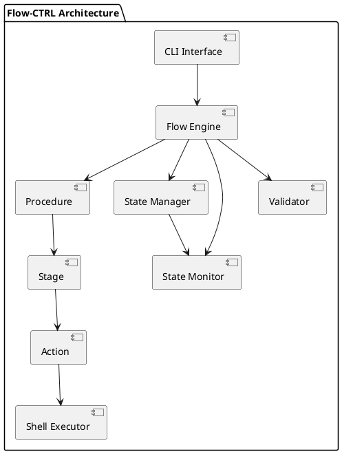

# Flow-CTRL Automation Framework

## Overview

Flow-CTRL is a Python3 based procedure automation framework that enables you to define, execute, and monitor complex workflows through JSON-based configuration (sketch) files. It provides a CLI interface, state management, and inter-process communication capabilities.

### Features
- **Declarative Automation**: Define procedures using JSON sketch files
- **Multi-Stage Workflows**: Organize automation into logical stages
- **Command Execution**: Execute shell commands with timeout and error handling
- **State Management**: Track procedure execution state with persistence
- **Flexible Actions**: Support for setup, teardown, success/failure handlers
- **CLI Interface**: Easy-to-use command-line interfac
- **Comprehensive Testing**: Full test suite with unit and integration tests

## Quick Start

### Basic Usage
```bash
# Start a procedure
~$ flow_ctrl --start --sketch-file sketchy_stuff.json

# Control a running procedure
~$ flow_ctrl --pause
~$ flow_ctrl --resume
~$ flow_ctrl --stop

# Clean up
~$ flow_ctrl --purge
```

### Example Procedure Sketch
```json
{
    "name": "Deployment Procedure",
    "setup_stage": [
        {
            "name": "create_backup",
            "cmd": "tar -czf backup-$(date +%Y%m%d).tar.gz /opt/myapp",
            "time": "5m",
            "timeout": "10m",
            "setup-cmd": "echo 'Starting backup...'",
            "teardown-cmd": "echo 'Backup completed'"
        }
    ],
    "deploy_stage": [
        {
            "name": "deploy_app",
            "cmd": "./deploy.sh",
            "time": "10m",
            "fatal-nok": true,
            "on-ok-cmd": "echo 'Deployment successful'",
            "on-nok-cmd": "echo 'Deployment failed - rolling back'"
        }
    ],
    "cleanup_stage": [
        {
            "name": "cleanup_temp",
            "cmd": "rm -rf /tmp/deploy_*",
            "time": "1m"
        }
    ]
}
```

## Installation

### From Source
```bash
~$ git clone <repository-url>
~$ cd FlowCTRL-Automation
~$ ./build.sh --setup -y && ./build.sh BUILD INSTALL
```

## User Guide

### Command Line Interface

#### Starting Procedures
```bash
# Basic start
~$ flow_ctrl --start --sketch-file procedure.json

# With debug output
~$ flow_ctrl --start --sketch-file procedure.json --debug

# Silent mode (no banner)
~$ flow_ctrl --start --sketch-file procedure.json --silence

# Ensuring cleanup of previous session details
~$ flow_ctrl --start --sketch-file procedure.json
```

#### Procedure Control
```bash
# Pause a running procedure from another process
~$ flow_ctrl --pause

# Resume a paused procedure
~$ flow_ctrl --resume

# Stop a procedure (does not interrupt ongoing stage action, but will not pick up another)
~$ flow_ctrl --stop

# Purge all state and logs
~$ flow_ctrl --purge
```

#### Example: External control

Flow-CTRL supports inter-process communication, allowing you to control running procedures from other terminals or scripts:
```bash
# In one terminal
flow_ctrl --start --sketch-file long_running.json

# In another terminal - control the running procedure
flow_ctrl --pause
flow_ctrl --resume
flow_ctrl --stop
```
## Sketch File Format

### Basic Structure
```json

{
    "name": "Procedure Name",
    "stage_name": [
        {
            "name": "action_name",
            "cmd": "shell command to execute",
            "time": "estimated_time",
            "timeout": "maximum_time",
            "setup-cmd": "pre-action command",
            "teardown-cmd": "post-action command",
            "on-ok-cmd": "success handler",
            "on-nok-cmd": "error handler",
            "fatal-nok": false
        }
    ]
}
```

### Time Format
    "5s" - 5 seconds
    "10m" - 10 minutes
    "1h" - 1 hour
    "2d" - 2 days

### Action Properties

    Property      Required	  Description

    name          Yes         Unique identifier for the action
    cmd           Yes         Shell command to execute
    time          No          Estimated execution time
    timeout       No          Maximum allowed execution time
    setup-cmd     No          Command to run before main action
    teardown-cmd  No          Command to run after main action
    on-ok-cmd     No          Command to run on success
    on-nok-cmd    No          Command to run on failure
    fatal-nok     No          If true, stops procedure on failure

## Developer Documentation

### Architecture Overview


### Core Components

- FlowEngine: Main coordination engine
- Procedure: Complete automation workflow
- Stage: Logical grouping of actions
- Action: Individual command execution unit
- StateManager: Execution state persistence

### FlowEngine

The main orchestrator that manages procedure execution with state monitoring.
```python
class FlowEngine:
    """Main engine coordinating automation workflows with state monitoring"""

    def __init__(self, config):
        """Initialize with configuration"""

    def load_procedure(self, sketch_file: str) -> bool:
        """Load procedure from JSON sketch file"""

    def start_procedure(self) -> ExecutionResult:
        """Start procedure execution with state monitoring"""

    def pause_procedure(self) -> ExecutionResult:
        """Pause current procedure"""

    def resume_procedure(self) -> ExecutionResult:
        """Resume paused procedure"""

    def stop_procedure(self) -> ExecutionResult:
        """Stop current procedure"""
```

### Procedure

Represents a complete automation workflow with multiple stages.
```python
class Procedure:
    """Represents a complete automation procedure"""

    def __init__(self, data: Dict[str, Any], config, sketch_file=None):
        """Initialize from sketch data"""

    def execute(self) -> bool:
        """Execute the complete procedure"""

    def get_progress(self) -> Dict[str, Any]:
        """Get current execution progress"""
```

### Stage

A group of related actions within a procedure.
```python
class Stage:
    """Represents a stage within a procedure"""

    def __init__(self, name: str, actions_data: List[Dict[str, Any]], config):
        """Initialize stage with actions"""

    def execute(self) -> bool:
        """Execute all actions in the stage"""
```

### Action

A single executable unit within a stage.
```python
class Action:
    """Represents a single automation action"""

    def __init__(self, data: Dict[str, Any], config):
        """Initialize action from configuration"""

    def execute(self) -> bool:
        """Execute the action with all associated commands"""
```

### State Management

Flow-CTRL uses a file-based state system for inter-process communication:
```python
class StateManager:
    """Manages procedure execution state with command capabilities"""

    def set_state(self, active: bool, action: str) -> bool:
        """Set overall procedure state"""

    def send_command(self, command: str) -> bool:
        """Send a command to the main process"""

    def get_full_state(self) -> Dict[str, Any]:
        """Get complete state information"""
```

### Utility Modules

#### ShellExecutor
```python
class ShellExecutor:
    """Executes shell commands with timeout and thread support"""

    def execute(self, command: str, user: Optional[str] = None) -> CommandResult:
        """Execute a shell command"""

    def execute_with_timeout(self, command: str, timeout: int,
                           user: Optional[str] = None) -> CommandResult:
        """Execute command with timeout"""
```

#### StateMonitor
```python
class StateMonitor:
    """Monitors state file for external commands and triggers callbacks"""

    def start_monitoring(self):
        """Start monitoring the state file"""

    def register_callback(self, action: str, callback: Callable):
        """Register a callback for a specific action"""
```

#### Configuration
```python
@dataclass
class FlowConfig:
    """Main configuration class"""

    project_dir: str
    log_dir: str = "/tmp/flow_ctrl"
    conf_dir: str = "conf"
    state_file: str = ".flow-ctrl.state.tmp"
    report_file: str = ".flow-ctrl.report.tmp"
    log_file: str = "flow-ctrl.log"
    log_name: str = "FlowCTRL"
    silence: bool = False
    debug: bool = False
```

## Testing

### Running Tests
```bash
# Run all tests
~$ ./build.sh --test

# Run specific test categories
~$ pytest flow_ctrl/tst/unit/ -v
~$ pytest flow_ctrl/tst/integration/ -v

# With coverage
~$ pytest --cov=flow_ctrl
```

### Test Structure

- **tst/unit/** - Unit tests for individual components
- **tst/integration/** - Integration tests for complete workflows
- **tst/fixtures/** - Test data and configuration helpers


## Troubleshooting
### Common Issues

- Procedure won't start
    - Check sketch file syntax with JSON validator
    - Verify all required fields are present in actions
    - Check file permissions

- Commands timing out
    - Increase timeout values in sketch file
    - Check command dependencies and paths
    - Verify system resources

- State file conflicts
    - Use --purge to clear existing state
    - Check for multiple running instances. Use different state file if needed

## Development Setup
```bash
# Clone and setup
~$ git clone <repository>
~$ cd flow-ctrl

# Install dependencies and create virtual environment
~$ ./build.sh --setup --development -y

# Build flow_ctrl wheel and install using pip
~$ ./build.sh BUILD INSTALL

# Run autotester suites
~$ ./build.sh --test

# Run black source code formatter followed by mypy, flake8 and pylint
~$ ./build.sh --format --check
```

